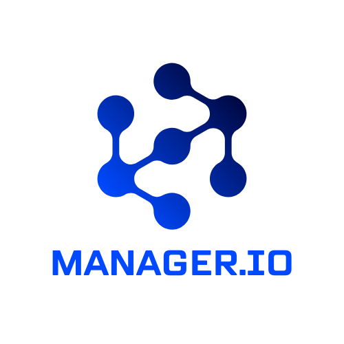

# Manager.io

  

O Manager.io é um sistema desenvolvido para otimizar a gestão e organização de processos empresariais, facilitando o controle de atividades, fluxo de trabalho e tomada de decisões. Com uma interface intuitiva e recursos de automação, a plataforma permite que gestores e equipes acompanhem seus processos de forma eficiente, garantindo maior produtividade e transparência nas operações.

O projeto tem como foco a implementação de uma solução escalável e acessível, utilizando boas práticas de desenvolvimento de software. Através de um ambiente colaborativo, o Manager.io busca integrar diferentes setores e facilitar a comunicação entre os envolvidos, promovendo uma gestão mais estratégica e orientada a dados.

## Integrantes

* Felipe Augusto Mendes
* Francisco Rafael Pereira 
* Gabriel Victor Souza Lopes
* Igor Rodrigo Costa
* João Pedro Maciel de Oliveira
* João Ricardo Fiuza

## Professor

* Michelle Hanna Soares de Andrade
* Danilo de Quadros Maia Filho
* Joana Gabriela Ribeiro de Souza

## Instruções de utilização

Assim que a primeira versão do sistema estiver disponível, deverá complementar com as instruções de utilização. Descreva como instalar eventuais dependências e como executar a aplicação.

## Histórico de versões

* 0.1.1
    * CHANGE: Atualização das documentações. Código permaneceu inalterado.
* 0.1.0
    * Implementação da funcionalidade X pertencente ao processo P.
* 0.0.1
    * Trabalhando na modelagem do processo de negócio.

