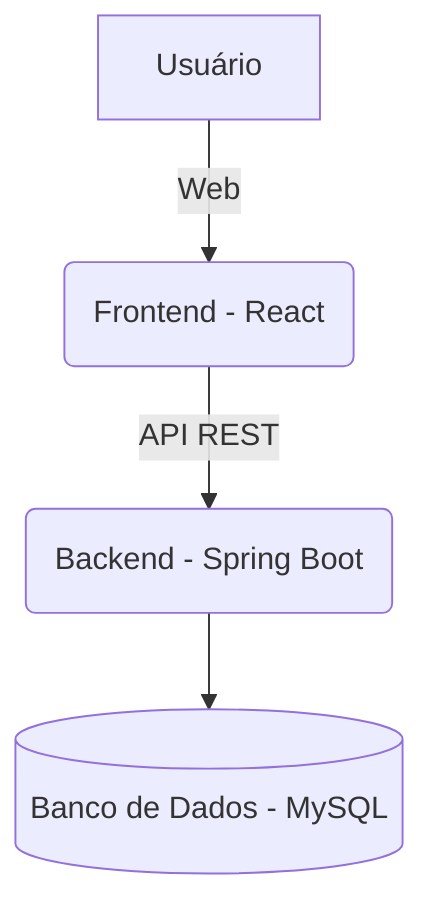

<div align="center">


# Plataforma de Gestão Empresarial Eficiente

[]()
[]()
[]()

[]()
[]()
[]()
[]()
[]()

</div>

---

> **Missão:**  
> Desenvolver uma solução **escalável**, **modular** e **acessível** para otimizar processos internos, aprimorar o controle de atividades e fornecer suporte à tomada de decisões estratégicas em ambientes colaborativos, transparentes e orientados a dados.

---

## ✨ Visão Geral

A Plataforma de Gestão Empresarial foi concebida para atender empresas que buscam digitalizar e automatizar operações administrativas, oferecendo módulos integrados de controle, relatórios e análises. Com arquitetura baseada em tecnologias modernas, o sistema proporciona desempenho, segurança e facilidade de uso.

---

## 👨‍💻 Tecnologias Principais

- **Frontend:** React.js, CSS3
- **Backend:** Spring Boot (Java 17+)
- **Banco de Dados:** MySQL (Docker opcional para desenvolvimento)
- **Outros:** Node.js, Docker

---

## 🏗️ Arquitetura da Solução



---

## 👥 Equipe & Orientadores

| Função             | Nome                                   |
|--------------------|----------------------------------------|
| 🥑 Desenvolvedor   | Felipe Augusto Mendes Pereira          |
| 🥥 Desenvolvedor   | Francisco Rafael Pereira               |
| 🍍 Desenvolvedor   | Gabriel Victor Souza Lopes             |
| 🍉 Desenvolvedor   | Igor Rodrigo Costa                     |
| 🍓 Desenvolvedor   | João Pedro Maciel de Oliveira          |
| 🥝 Desenvolvedor   | João Ricardo Fiuza                     |
| 👩‍🏫 Orientadora   | Michelle Hanna Soares de Andrade       |
| 👨‍🏫 Orientador    | Danilo de Quadros Maia Filho           |
| 👩‍🏫 Orientadora   | Joana Gabriela Ribeiro de Souza        |

---

## 🚀 Guia Rápido de Instalação

### Pré-requisitos

- [Docker](https://www.docker.com/) *(opcional, para MySQL)*
- [Java JDK 17+](https://www.oracle.com/java/technologies/downloads/)
- [Node.js (LTS)](https://nodejs.org/)
- [MySQL 8.0+](https://dev.mysql.com/downloads/)
- [Git](https://git-scm.com/)

### Instalação Rápida

1. **Clone o repositório:**
    ```bash
    git clone https://github.com/ICEI-PUC-Minas-PMGES-TI/pmg-es-2025-1-ti2-3740100-sistemamanutencaot-i.git
    cd pmg-es-2025-1-ti2-3740100-sistemamanutencaot-i
    ```

2. **Configure o banco de dados:**
    ```sql
    CREATE DATABASE manager_io;
    CREATE USER 'manager_user'@'localhost' IDENTIFIED BY 'manager_pass';
    GRANT ALL PRIVILEGES ON manager_io.* TO 'manager_user'@'localhost';
    ```

3. **Execute o backend:**
    ```bash
    cd src/back/backend
    ./mvnw spring-boot:run
    ```

4. **Execute o frontend:**
    ```bash
    cd src/front/FrontEnd
    npm install
    npm run dev
    ```

5. **Acesse a aplicação:**
    - **Frontend:** [http://localhost:3000](http://localhost:3000)
    - **Backend API:** [http://localhost:8080](http://localhost:8080)

> 📖 **Instalação Detalhada:** Consulte o [INSTALL.md](INSTALL.md) para guia completo  
> 📡 **Documentação da API:** Veja [docs/API.md](docs/API.md)

---
    ```bash
    cd frontend
    npm install
    npm start
    ```

5. **Acesse a plataforma:**
    - O frontend estará disponível em [http://localhost:3000](http://localhost:3000).
    - O backend (API) rodará em [http://localhost:8080](http://localhost:8080).

---

## 📂 Estrutura do Projeto

```
pmg-es-2025-1-ti2-3740100-sistemamanutencaot-i/
├── 📄 README.md                 # Documentação principal
├── 📄 INSTALL.md                # Guia de instalação detalhado
├── 📄 CITATION.cff              # Metadados de citação
├── 🐳 docker-compose.yml        # Configuração Docker
├── 📁 docs/                     # Documentação do projeto
│   ├── 📄 API.md                # Documentação da API
│   ├── 📄 interface.md          # Especificação da interface
│   ├── 📄 solution-design.md    # Design da solução
│   ├── 📄 processo-*.md         # Documentação dos processos
│   ├── 📁 images/               # Imagens e diagramas
│   └── 📁 presentations/        # Apresentações do projeto
├── 📁 src/                      # Código fonte
│   ├── 📁 back/                 # Backend (Spring Boot)
│   │   ├── 📄 README.md         # Documentação do backend
│   │   └── 📁 backend/          # Projeto Spring Boot
│   │       ├── 📄 pom.xml       # Dependências Maven
│   │       └── 📁 src/          # Código Java
│   └── 📁 front/                # Frontend (React)
│       ├── 📄 README.md         # Documentação do frontend
│       └── 📁 FrontEnd/         # Projeto React
│           ├── 📄 package.json  # Dependências npm
│           ├── 📁 src/          # Código React
│           │   ├── 📁 components/ # Componentes reutilizáveis
│           │   ├── 📁 pages/    # Páginas da aplicação
│           │   └── 📁 assets/   # Recursos estáticos
│           └── 📁 public/       # Arquivos públicos
└── 📁 video/                    # Vídeos demonstrativos
```

### 🎯 Componentes Principais

| Componente | Tecnologia | Descrição |
|------------|------------|-----------|
| **Frontend** | React + Vite | Interface web responsiva |
| **Backend** | Spring Boot + JPA | API REST e lógica de negócio |
| **Banco de Dados** | MySQL | Persistência de dados |
| **Documentação** | Markdown | Guias e especificações |

---

## 📊 Funcionalidades (Roadmap)

- [x] Estrutura inicial do projeto
- [x] Cadastro e autenticação de usuários
- [ ] Módulo de gestão de tarefas/processos
- [ ] Relatórios e dashboards customizáveis
- [ ] Controle de permissões e acessos
- [ ] Integração com sistemas externos (APIs)
- [ ] Testes automatizados

---

## 📚 Documentação

### 📖 Guias Principais
- 📄 **[Guia de Instalação](INSTALL.md)** - Setup completo do ambiente
- 📡 **[Documentação da API](docs/API.md)** - Endpoints e exemplos
- 🤝 **[Guia de Contribuição](CONTRIBUTING.md)** - Como contribuir
- 📝 **[Changelog](CHANGELOG.md)** - Histórico de mudanças

### 🛠 Documentação Técnica
- ⚙️ **[Backend](src/back/README.md)** - Spring Boot, JPA, MySQL
- 🎨 **[Frontend](src/front/README.md)** - React, Vite, Components
- 🏗 **[Arquitetura](docs/solution-design.md)** - Design da solução

### 📋 Processos de Negócio
- 🏪 **[Gestão de Lojas](docs/processo-1-gerenciar-cadastro-de-loja.md)**
- 👥 **[Gestão de Clientes](docs/processo-2-gerenciar-cadastro-de-cliente.md)**
- 🔧 **[Gestão de Técnicos](docs/processo-3-gerenciar-cadastro-de-tecnico.md)**
- 🔍 **[Diagnóstico](docs/processo-4-diagnostico.md)**
- 📋 **[Ordens de Serviço](docs/processo-5-ordem-de-servico.md)**
- 💰 **[Processo Financeiro](docs/processo-6-processo-financeiro.md)**
- 🛠 **[Manutenção](docs/processo-7-manutencao.md)**
- 📦 **[Requisição de Peças](docs/processo-8-requisicao-pecas.md)**

---

## 🤝 Como Contribuir

Contribuições são sempre bem-vindas! Veja como você pode ajudar:

### 🚀 Formas de Contribuir
- 🐛 **Reportar bugs** - Encontrou um problema? [Abra uma issue](https://github.com/ICEI-PUC-Minas-PMGES-TI/pmg-es-2025-1-ti2-3740100-sistemamanutencaot-i/issues)
- ✨ **Sugerir melhorias** - Tem uma ideia? Compartilhe conosco!
- 📝 **Melhorar documentação** - Toda contribuição é valiosa
- 🔧 **Desenvolver features** - Implemente novas funcionalidades

### 📋 Processo de Contribuição
1. Faça um **fork** do repositório
2. Crie uma **branch** para sua feature: `git checkout -b feature/nome-da-feature`
3. **Commit** suas mudanças: `git commit -m 'feat: adiciona nova funcionalidade'`
4. **Push** para a branch: `git push origin feature/nome-da-feature`
5. Abra um **Pull Request**

> 📖 **Guia Completo:** Consulte [CONTRIBUTING.md](CONTRIBUTING.md) para instruções detalhadas

---

## 🔗 Links Úteis

### 📚 Recursos de Aprendizado
- [React Documentation](https://react.dev/) - Documentação oficial do React
- [Spring Boot Guide](https://spring.io/guides) - Guias do Spring Boot
- [MySQL Documentation](https://dev.mysql.com/doc/) - Documentação do MySQL

### 🛠 Ferramentas de Desenvolvimento
- [Visual Studio Code](https://code.visualstudio.com/) - Editor recomendado
- [Postman](https://www.postman.com/) - Teste de APIs
- [MySQL Workbench](https://www.mysql.com/products/workbench/) - Gerenciador de banco

### 🎯 Padrões e Boas Práticas
- [Conventional Commits](https://www.conventionalcommits.org/) - Padrão de commits
- [Keep a Changelog](https://keepachangelog.com/) - Formato do changelog
- [Semantic Versioning](https://semver.org/) - Versionamento semântico

---

## 💬 Suporte

Dúvidas, sugestões ou problemas?  
Abra uma [issue](https://github.com/ICEI-PUC-Minas-PMGES-TI/pmg-es-2025-1-ti2-3740100-sistemamanutencaot-i/issues) ou entre em contato com um dos desenvolvedores.

---

## 📝 Licença

Este projeto está licenciado sob os termos da [MIT License](LICENSE).

---

<div align="center">

Feito com ❤️ por estudantes da Engenharia de Software da PUC Minas.

</div>
