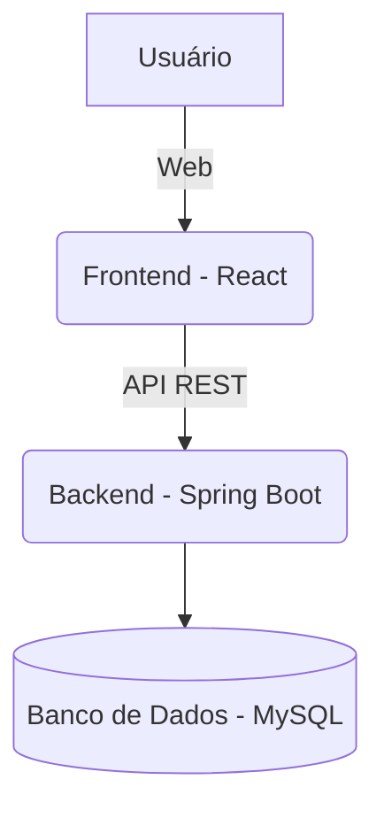

<div align="center">


# Plataforma de Gestão Empresarial Eficiente

[]()
[]()
[]()

[]()
[]()
[]()
[]()
[]()

</div>

---

> **Missão:**  
> Desenvolver uma solução **escalável**, **modular** e **acessível** para otimizar processos internos, aprimorar o controle de atividades e fornecer suporte à tomada de decisões estratégicas em ambientes colaborativos, transparentes e orientados a dados.

---

## ✨ Visão Geral

A Plataforma de Gestão Empresarial foi concebida para atender empresas que buscam digitalizar e automatizar operações administrativas, oferecendo módulos integrados de controle, relatórios e análises. Com arquitetura baseada em tecnologias modernas, o sistema proporciona desempenho, segurança e facilidade de uso.

---

## 👨‍💻 Tecnologias Principais

- **Frontend:** React.js, CSS3
- **Backend:** Spring Boot (Java 17+)
- **Banco de Dados:** MySQL (Docker opcional para desenvolvimento)
- **Outros:** Node.js, Docker

---

## 🏗️ Arquitetura da Solução



---

## 👥 Equipe & Orientadores

| Função             | Nome                                   |
|--------------------|----------------------------------------|
| 🥑 Desenvolvedor   | Felipe Augusto Mendes Pereira          |
| 🥥 Desenvolvedor   | Francisco Rafael Pereira               |
| 🍍 Desenvolvedor   | Gabriel Victor Souza Lopes             |
| 🍉 Desenvolvedor   | Igor Rodrigo Costa                     |
| 🍓 Desenvolvedor   | João Pedro Maciel de Oliveira          |
| 🥝 Desenvolvedor   | João Ricardo Fiuza                     |
| 👩‍🏫 Orientadora   | Michelle Hanna Soares de Andrade       |
| 👨‍🏫 Orientador    | Danilo de Quadros Maia Filho           |
| 👩‍🏫 Orientadora   | Joana Gabriela Ribeiro de Souza        |

---

## 🚀 Guia Rápido de Instalação

> ⚠️ **Observação:**  
> As etapas abaixo são iniciais. Elas serão detalhadas à medida que o sistema evoluir.

### Pré-requisitos

- [Node.js (LTS)](https://nodejs.org/)
- [Java JDK 17+](https://www.oracle.com/java/technologies/downloads/)
- [Docker](https://www.docker.com/) *(opcional, para MySQL)*

### Instalação

1. **Clone este repositório:**
    ```bash
    git clone https://github.com/ICEI-PUC-Minas-PMGES-TI/pmg-es-2025-1-ti2-3740100-sistemamanutencaot-i.git
    cd pmg-es-2025-1-ti2-3740100-sistemamanutencaot-i
    ```

2. **Configure o banco de dados:**
    - Com Docker:
      ```bash
      docker run --name sistema-db -e MYSQL_ROOT_PASSWORD=suasenha -e MYSQL_DATABASE=sistemadb -p 3306:3306 -d mysql:8.0
      ```
    - Ou instale o MySQL localmente e crie o banco `sistemadb`.

3. **Configuração do Backend:**
    - Abra o diretório `backend` em sua IDE Java.
    - Configure as variáveis de ambiente (exemplo: `application.properties`) com as credenciais do banco.
    - Execute a aplicação Spring Boot.

4. **Configuração do Frontend:**
    ```bash
    cd frontend
    npm install
    npm start
    ```

5. **Acesse a plataforma:**
    - O frontend estará disponível em [http://localhost:3000](http://localhost:3000).
    - O backend (API) rodará em [http://localhost:8080](http://localhost:8080).

---

## 📂 Estrutura do Projeto

```
/
├── backend/        # Código do Spring Boot
├── frontend/       # Aplicação React
├── docs/           # Documentação e imagens
└── README.md
```

---

## 📊 Funcionalidades (Roadmap)

- [x] Estrutura inicial do projeto
- [ ] Cadastro e autenticação de usuários
- [ ] Módulo de gestão de tarefas/processos
- [ ] Relatórios e dashboards customizáveis
- [ ] Controle de permissões e acessos
- [ ] Integração com sistemas externos (APIs)
- [ ] Testes automatizados

---

## 🤝 Como Contribuir

1. Faça um fork deste repositório
2. Crie uma branch: `git checkout -b feature/nome-da-feature`
3. Faça suas alterações e commit: `git commit -m 'feat: descrição da feature'`
4. Faça push para sua branch: `git push origin feature/nome-da-feature`
5. Abra um Pull Request

---

## 💬 Suporte

Dúvidas, sugestões ou problemas?  
Abra uma [issue](https://github.com/ICEI-PUC-Minas-PMGES-TI/pmg-es-2025-1-ti2-3740100-sistemamanutencaot-i/issues) ou entre em contato com um dos desenvolvedores.

---

## 📝 Licença

Este projeto está licenciado sob os termos da [MIT License](LICENSE).

---

<div align="center">

Feito com ❤️ por estudantes da Engenharia de Software da PUC Minas.

</div>
