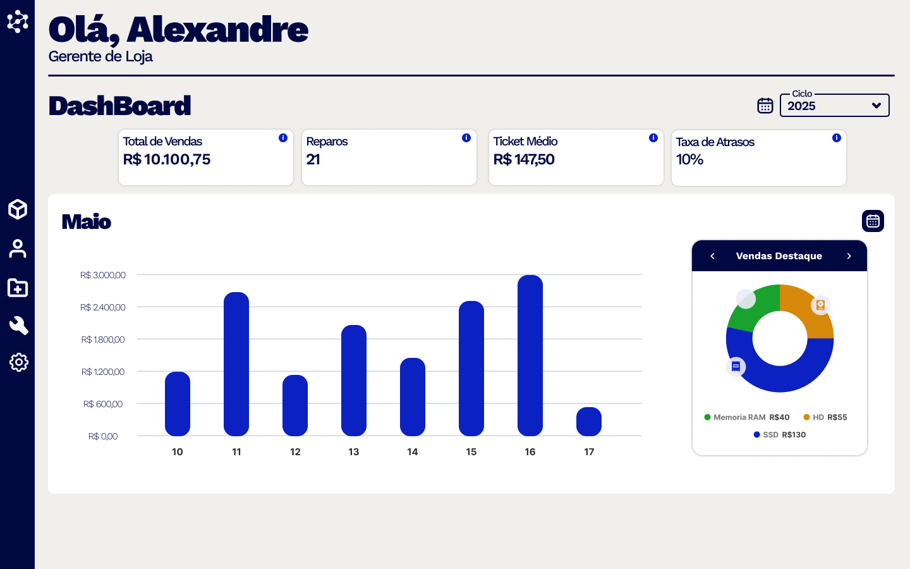
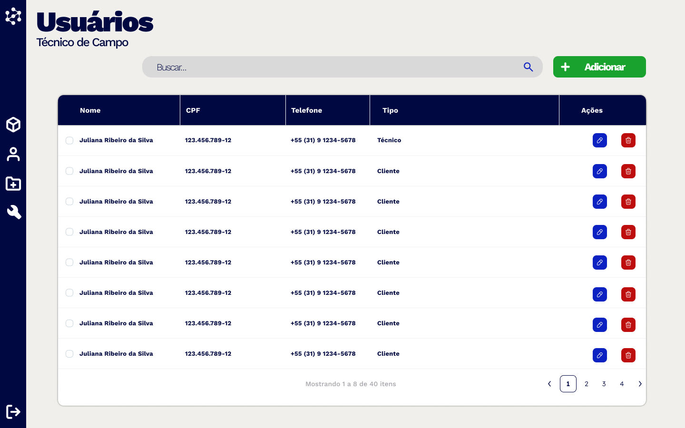
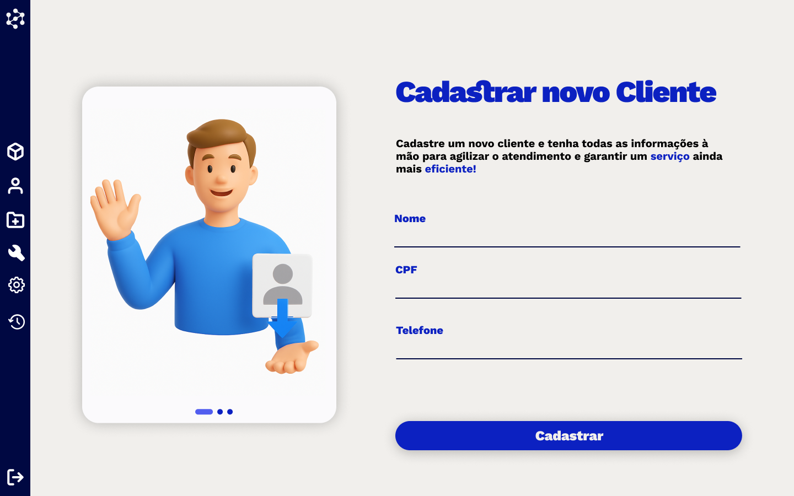
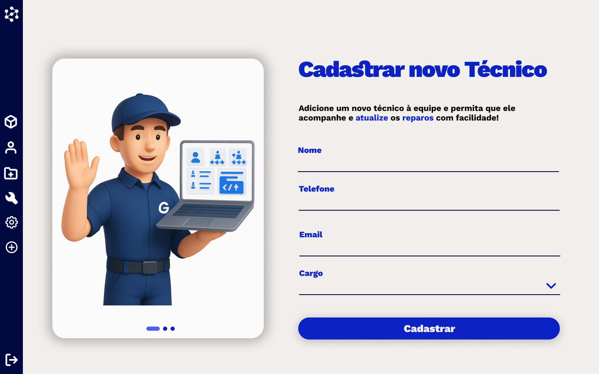
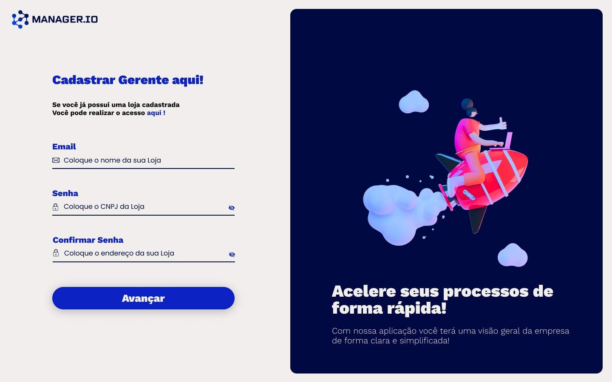
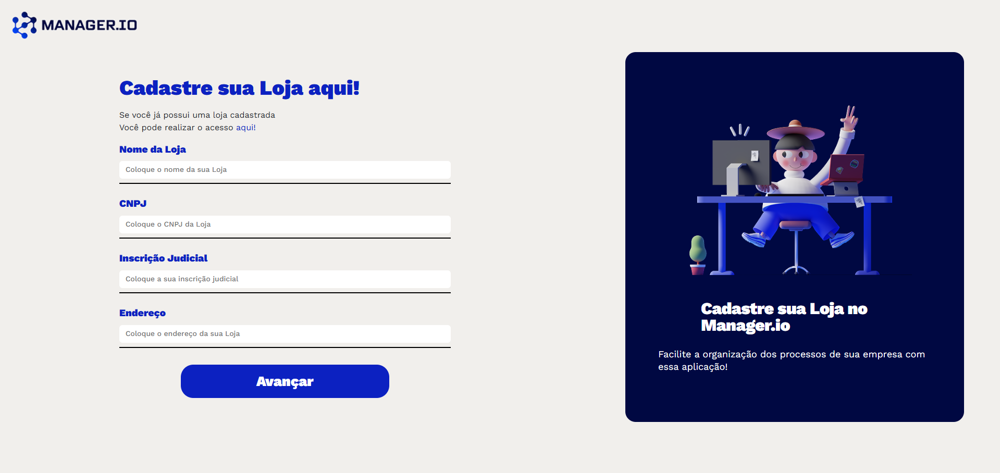
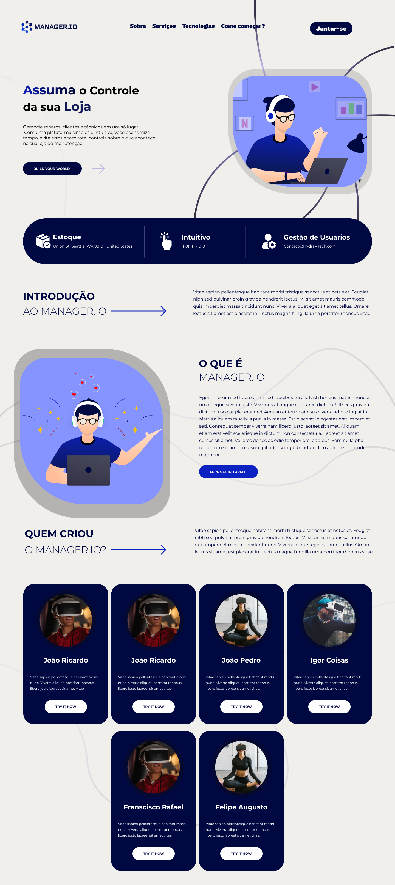
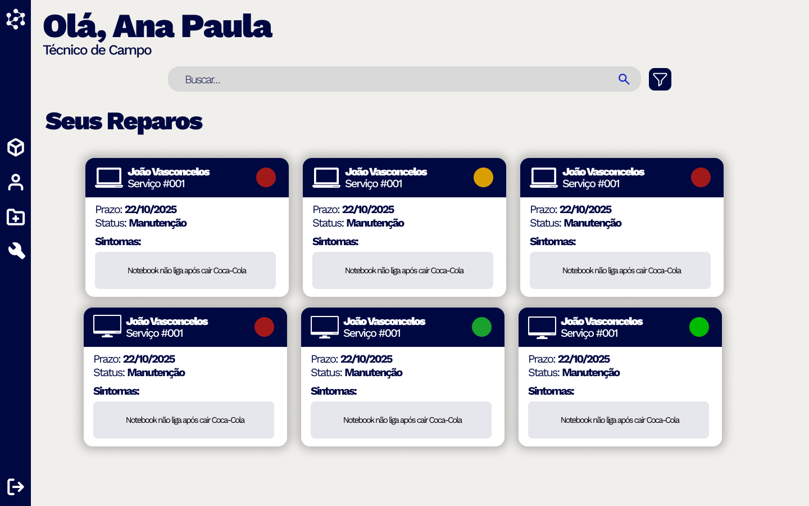
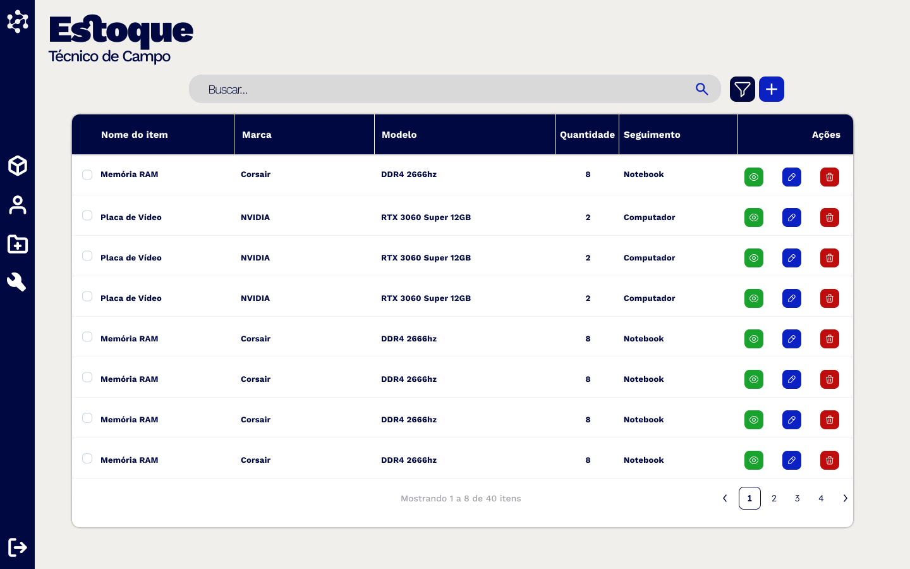
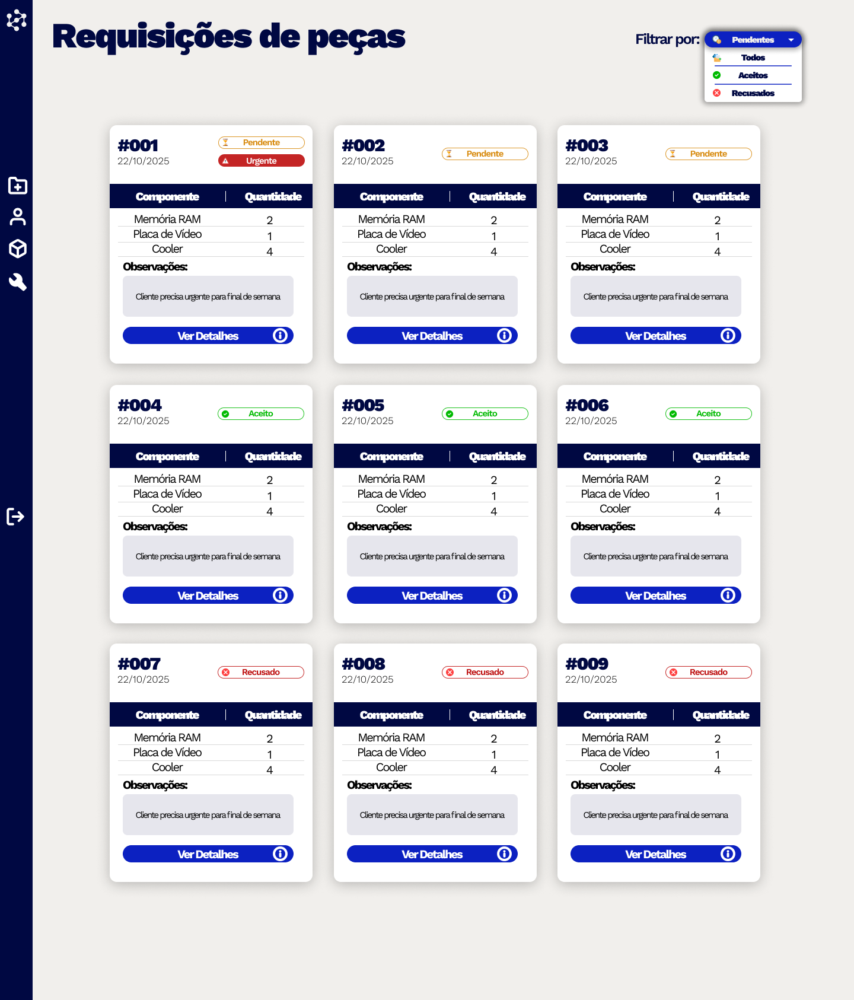

# Interface do Sistema

Visão geral da interação do usuário por meio das telas do sistema Manager.io.

## Tela principal do sistema

O dashboard é a primeira tela que o usuário vê após fazer login. Apresenta um resumo geral do sistema com métricas e indicadores principais.

*Figura 1: Dashboard principal com visão geral das métricas do sistema*

### Características do Dashboard:
- Cards informativos com números de clientes, técnicos e ordens
- Gráficos de performance
- Menu de navegação lateral
- Informações do usuário logado no cabeçalho

## Telas do processo de gerenciamento de usuários

### Lista de Usuários

Tela principal para visualização e gerenciamento de todos os usuários cadastrados no sistema.

*Figura 2: Tela de gerenciamento de usuários com funcionalidades de pesquisa, filtro e paginação*

**Funcionalidades disponíveis:**
- Pesquisa em tempo real por nome, CPF, telefone
- Filtro por tipo de usuário (Cliente/Técnico)
- Paginação para navegação eficiente
- Opção de editar ou excluir usuários
- Indicador visual do tipo de usuário

### Cadastro de Cliente

Formulário completo para cadastro de novos clientes no sistema.

*Figura 3: Tela de cadastro de cliente com todos os campos necessários*

**Campos principais:**
- Dados pessoais (nome, CPF, email, telefone)
- Endereço completo
- Observações adicionais

### Cadastro de Técnico

Tela específica para cadastro de técnicos com informações profissionais.

*Figura 4: Formulário de cadastro de técnico com campos profissionais*

**Informações adicionais:**
- Especialidade técnica
- Nível profissional
- Status ativo/inativo
- Certificações

## Telas de configuração e gestão

### Cadastro de Gerente

Interface para cadastro de usuários com perfil de gerente.

*Figura 5: Tela de cadastro para perfil gerencial*

### Cadastro de Loja

Formulário para cadastro de filiais ou unidades da empresa.

*Figura 6: Interface para cadastro de lojas/filiais*

### Configurações do Sistema

Tela de configurações gerais do sistema.

*Figura 7: Painel de configurações do sistema*

## Telas específicas por perfil de usuário

### Landing Page

Página inicial de apresentação do sistema antes do login.

*Figura 8: Página inicial de apresentação do sistema Manager.io*

### Tela Principal do Técnico

Interface principal para usuários com perfil de técnico, com acesso às funcionalidades específicas.

*Figura 9: Dashboard personalizado para técnicos com suas funções principais*

### Usuários - Visão do Técnico

Tela de visualização de usuários com perspectiva do técnico.

*Figura 10: Interface de usuários adaptada para o perfil de técnico*

## Telas de processos operacionais

### Estoque - Visão do Gerente

Tela de controle de estoque com funcionalidades administrativas para gerentes.

*Figura 11: Interface de controle de estoque com visão gerencial*

### Requisição de Peças

Formulário para solicitação de peças e materiais necessários para manutenção.

*Figura 12: Tela de requisição de peças para serviços de manutenção*

## Padrões visuais da interface

### Características gerais:
- Design limpo e moderno
- Cores consistentes (azul escuro como primária)
- Formulários bem organizados em seções
- Botões com ícones intuitivos
- Layout responsivo para diferentes dispositivos

### Elementos comuns:
- Cabeçalho com logo e informações do usuário
- Menu lateral de navegação
- Breadcrumbs para localização
- Campos obrigatórios marcados com asterisco
- Botões de ação padronizados (Salvar, Cancelar, etc.)

### Diretrizes de design:
- **Responsividade:** Todas as telas se adaptam a diferentes tamanhos de dispositivos
- **Acessibilidade:** Textos alternativos em imagens e contraste adequado
- **Usabilidade:** Interface intuitiva com fluxos lógicos de navegação
- **Consistência:** Padrões visuais mantidos em todo o sistema

### Notas para desenvolvedores:
- Para adicionar novas imagens, salve-as no diretório `docs/images/interface/`
- Use nomes descritivos para os arquivos (ex: `Nome_Funcionalidade.png`)
- Mantenha a numeração sequencial das figuras
- Inclua sempre legendas explicativas com `*Figura X: descrição*`

