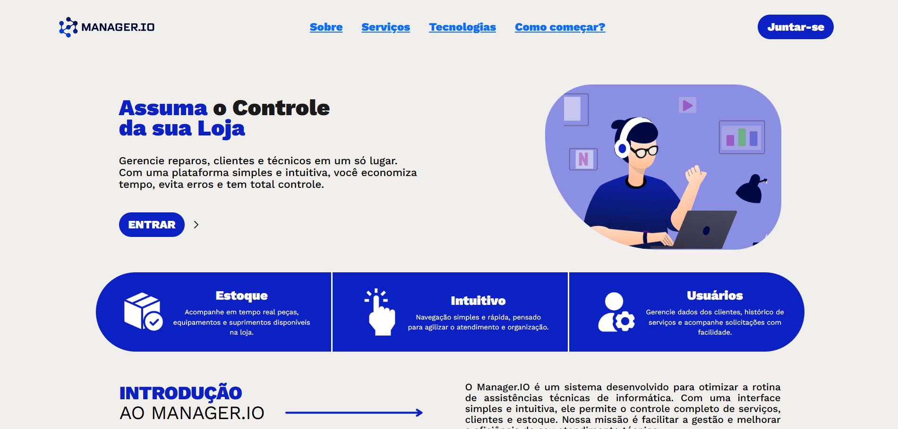

# Interface do Sistema

Este documento apresenta uma visão geral detalhada da interface do usuário do sistema Manager.io, incluindo todas as telas, funcionalidades e padrões de design utilizados.

## Landing Page

A página inicial do sistema serve como ponto de entrada e apresentação da plataforma aos usuários antes do processo de autenticação.

*Figura 1: Página inicial de apresentação do sistema Manager.io com elementos de branding e acesso ao login*

## Processo 1 - Gerenciamento de Lojas

### Cadastro de Loja

Interface dedicada ao cadastro de filiais ou unidades da empresa no sistema, permitindo o registro completo de informações essenciais para cada estabelecimento.

*Figura 2: Interface para cadastro de lojas/filiais com campos para informações básicas da unidade*

**Campos principais:**
- Nome
- CNPJ 
- Inscrição estadual
- Endereço completo

### Cadastro de Login Master

Interface especializada para cadastro de usuários com perfil administrativo, responsáveis pela gestão das lojas.

*Figura 3: Tela de cadastro para perfil gerencial com dados de acesso e permissões*

**Informações requeridas:**
- Dados de contato
- Credenciais de acesso (login e senha)

### Edição de Loja

Funcionalidade para atualização e modificação dos dados cadastrais das lojas já registradas no sistema.

*Figura 4: Interface de edição para atualização dos dados cadastrais da loja*

## Dashboard Principal do Sistema

O dashboard representa o centro de controle do sistema, sendo a primeira interface apresentada aos usuários Master após a autenticação. Oferece uma visão panorâmica das operações e métricas essenciais do negócio.

*Figura 5: Dashboard principal com visão geral das métricas operacionais e indicadores de performance*

### Componentes do Dashboard:
- **Cards informativos:** Exibição consolidada de números de clientes, técnicos e ordens de serviço
- **Gráficos de performance:** Análise visual de tendências e indicadores chave
- **Menu de navegação lateral:** Acesso rápido a todas as funcionalidades do sistema
- **Cabeçalho personalizado:** Informações do usuário logado e configurações de perfil
- **Widgets customizáveis:** Painéis adaptativos conforme o perfil do usuário

## Gerenciamento de Usuários

### Lista de Usuários

Interface central para visualização, pesquisa e administração de todos os usuários registrados no sistema, oferecendo ferramentas completas de gestão.

*Figura 6: Tela de gerenciamento de usuários com funcionalidades avançadas de pesquisa, filtro e paginação*

**Funcionalidades disponíveis:**
- **Pesquisa inteligente:** Busca em tempo real por nome, CPF, telefone ou email
- **Filtros avançados:** Segmentação por tipo de usuário (Cliente/Técnico), status e período
- **Paginação otimizada:** Navegação eficiente através de grandes listas de usuários
- **Ações rápidas:** Opções de editar, visualizar detalhes ou excluir usuários

## Processo 2 - Gerenciamento de Clientes

### Seleção de Tipo de Usuário

Interface para definição do tipo de usuário a ser cadastrado no sistema.

*Figura 7: Tela de seleção para escolha do tipo de usuário a ser cadastrado*

### Cadastro de Cliente

Formulário completo e estruturado para registro de novos clientes no sistema, contemplando todas as informações necessárias para o relacionamento comercial.

*Figura 8: Tela de cadastro de cliente com formulário completo e validação de dados*

**Campos obrigatórios:**
- **Dados pessoais:** Nome e CPF
- **Informações de contato:** telefone principal

**Validações implementadas:**
- Verificação de CPF válido
- Validação de formato de email
- Confirmação de telefone com DDD

### Edição de Cliente

Interface para atualização e modificação dos dados de clientes já cadastrados no sistema.

*Figura 9: Tela de edição de cliente com preservação do histórico de alterações*

## Processo 3 - Gerenciamento de Técnicos

### Seleção de Tipo de Usuário

Interface para definição do perfil técnico a ser cadastrado no sistema.

*Figura 10: Tela de seleção para criação de usuário técnico*

### Cadastro de Técnico

Interface especializada para registro de profissionais técnicos, incluindo informações específicas sobre qualificações e especialidades.

*Figura 11: Formulário de cadastro de técnico com campos profissionais e de qualificação*

**Informações técnicas requeridas:**
- **Dados pessoais:** Nome e CPF
- **Dados profissionais:** Cargo

### Edição de Técnico

Funcionalidade para atualização de dados dos técnicos, incluindo qualificações e status de disponibilidade.

*Figura 12: Interface de edição de técnico com campos específicos da profissão*

## Usuários Atualizados

Visualização do sistema após atualizações e melhorias na interface de gerenciamento de usuários.

*Figura 13: Interface atualizada de gerenciamento de usuários com melhorias de usabilidade*

**Melhorias implementadas:**
- Layout mais intuitivo e responsivo
- Filtros aprimorados com múltiplas opções

## Processo 4 - Diagnóstico e Ordens de Serviço

### Listagem de Ordens de Serviço

Interface principal para visualização e gerenciamento de todas as ordens de serviço registradas no sistema.

*Figura 14: Tela principal de ordens de serviço com listagem completa e filtros*

**Funcionalidades da tela:**
- Visualização de todas as OS em diferentes status
- Filtros por período, técnico, cliente e status
- Busca por número da OS ou dados do cliente
- Indicadores visuais de prioridade e urgência
- Ações rápidas para edição e visualização

### Diagnóstico

Processo de análise técnica inicial para identificação de problemas e definição de soluções.

*Figura 15: Interface de diagnóstico técnico com campos para análise detalhada*

**Etapas do diagnóstico:**
- Recebimento e inspeção inicial do equipamento
- Identificação de problemas e falhas
- Análise técnica detalhada
- Estimativa de tempo e custo de reparo
- Aprovação do cliente para prosseguimento

### Ordens de Serviço Atualizadas

Versão melhorada da interface de ordens de serviço com novas funcionalidades e design otimizado.

*Figura 16: Interface atualizada de ordens de serviço com melhorias de usabilidade e performance*

## Processo 5 - Execução e Detalhamento de Ordens de Serviço

### Vinculação de Ordem de Serviço

Interface para associação de ordens de serviço a técnicos específicos e definição de cronograma de execução.

*Figura 17: Tela de vinculação de OS com seleção de técnico e agendamento*

**Funcionalidades de vinculação:**
- Seleção de técnico disponível
- Priorização automática baseada em critérios

### Detalhamento da Ordem de Serviço

Visualização completa dos detalhes e especificações técnicas da ordem de serviço.

*Figura 18: Tela de detalhes da OS com informações completas do serviço*

### Utilização de Peças do Estoque

Processo para seleção e aplicação de peças disponíveis no estoque para a execução do serviço.

*Figura 19: Interface para seleção de peças do estoque com consulta de disponibilidade*

### Utilização de Peças Atualizada

Versão melhorada do processo de utilização de peças com interface otimizada.

*Figura 20: Interface atualizada para uso de peças com melhor experiência do usuário*

### Ordem de Serviço com Peças Vinculadas

Visualização da OS após a vinculação de peças necessárias para a execução do serviço.

*Figura 21: OS com peças do estoque vinculadas e custos calculados*

### Edição de Ordem de Serviço

Interface para modificação e atualização de informações da ordem de serviço durante sua execução.

*Figura 22: Tela de edição de OS com campos modificáveis e controle de versão*

## Processo 6 - Gestão Financeira

### Definição de Valores da Ordem de Serviço

Interface dedicada ao cálculo e definição dos valores financeiros associados à ordem de serviço, incluindo mão de obra e materiais.

*Figura 23: Tela de definição de valores da OS com cálculo automático de custos*

**Componentes financeiros:**
- **Valor da mão de obra:** Cálculo baseado na complexidade e tempo estimado
- **Custo de peças e materiais:** Valores atualizados do estoque
- **Total geral:** Soma automatizada de todos os componentes

## Processo 7 - Manutenção Preventiva e Corretiva

### Gestão de Manutenção

Módulo dedicado ao planejamento e execução de atividades de manutenção preventiva e corretiva de equipamentos.

**Funcionalidades do módulo:**
- **Histórico de manutenções:** Registro completo de todas as intervenções realizadas

## Processo 8 - Requisição de Peças

### Solicitação de Peças

Interface para requisição de peças e materiais necessários para execução de serviços, quando não disponíveis no estoque local.

*Figura 24: Tela de solicitação de peças com formulário detalhado*

**Campos da requisição:**
- **Identificação da peça:** Nome, modelo, marca e segmento

### Solicitação de Peças Atualizada

Versão melhorada do processo de requisição com interface otimizada e novas funcionalidades.

*Figura 25: Interface atualizada de solicitação de peças com melhorias de usabilidade*

**Melhorias implementadas:**
- Aprovação digital do gestor responsável
- Rastreamento em tempo real do status da solicitação
- Histórico completo de requisições por técnico

## Gestão de Estoque

### Visualização do Estoque

Interface principal para controle e monitoramento do inventário de peças e materiais disponíveis.

*Figura 26: Tela principal de gestão de estoque com listagem completa de itens*

**Funcionalidades do estoque:**
- **Consulta de disponibilidade:** Verificação em tempo real de quantidades disponíveis
- **Pontos de reposição:** Alertas automáticos para itens com estoque baixo
- **Valorização do estoque:** Cálculo do valor total do inventário
- **Relatórios gerenciais:** Análises de giro, obsolescência e performance
- **Rastreabilidade:** Histórico completo de cada item do estoque

### Adição ao Estoque

Processo para registro de entrada de novas peças e materiais no inventário.

*Figura 27: Interface de entrada de peças no estoque com validação de dados*

**Dados de entrada:**
- Tipo
- Marca
- Modelo
- Preço
- Segmento
- Quantidade

### Estoque Atualizado

Visualização do sistema de estoque após implementação de melhorias e otimizações.

*Figura 28: Interface atualizada de estoque com melhorias de performance e usabilidade*

### Edição de Itens do Estoque

Interface para modificação e atualização dos dados de peças já cadastradas no estoque.

*Figura 29: Tela de edição de itens do estoque com controle de alterações e auditoria*

## Padrões Visuais da Interface

### Características Gerais:
- **Design limpo e moderno:** Interface minimalista com foco na funcionalidade
- **Cores consistentes:** Paleta baseada em azul escuro como cor primária, complementada por tons neutros
- **Formulários bem estruturados:** Organização lógica em seções com agrupamento por contexto
- **Iconografia intuitiva:** Uso de ícones padronizados e reconhecíveis universalmente
- **Layout responsivo:** Adaptação automática para diferentes dispositivos e resoluções de tela

### Elementos Comuns da Interface:
- **Cabeçalho padronizado:** Logo da empresa, informações do usuário logado e configurações de perfil
- **Menu lateral de navegação:** Estrutura hierárquica com acesso rápido a todas as funcionalidades
- **Breadcrumbs contextuais:** Navegação estrutural para localização dentro do sistema
- **Indicadores de campos obrigatórios:** Marcação visual clara com asterisco (*) 
- **Botões de ação padronizados:** Uniformidade em Salvar, Cancelar, Editar, Excluir, etc.
- **Mensagens de feedback:** Sistema consistente de notificações de sucesso, erro e alerta

### Diretrizes de Design e Usabilidade:
- **Responsividade total:** Todas as interfaces se adaptam perfeitamente a tablets, smartphones e desktops
- **Acessibilidade garantida:** Textos alternativos em imagens, contraste adequado para pessoas com deficiência visual
- **Usabilidade otimizada:** Fluxos de navegação intuitivos com redução de cliques necessários
- **Consistência visual:** Manutenção rigorosa de padrões visuais em todo o sistema
- **Performance otimizada:** Carregamento rápido e interações fluidas mesmo em conexões lentas

### Notas Técnicas para Desenvolvedores:
- **Diretório de imagens:** Todas as capturas de tela devem ser salvas em `docs/images/interface/`
- **Nomenclatura de arquivos:** Utilize nomes descritivos e padronizados (ex: `Cadastro_Cliente.png`, `Edicao_OS.png`)
- **Numeração sequencial:** Mantenha a ordem lógica das figuras conforme aparecem na documentação
- **Legendas obrigatórias:** Inclua sempre descrições explicativas no formato `*Figura X: descrição detalhada*`
- **Versionamento de imagens:** Mantenha histórico de versões para rastreabilidade de mudanças
- **Otimização de arquivos:** Comprima imagens para web mantendo qualidade adequada para visualização

