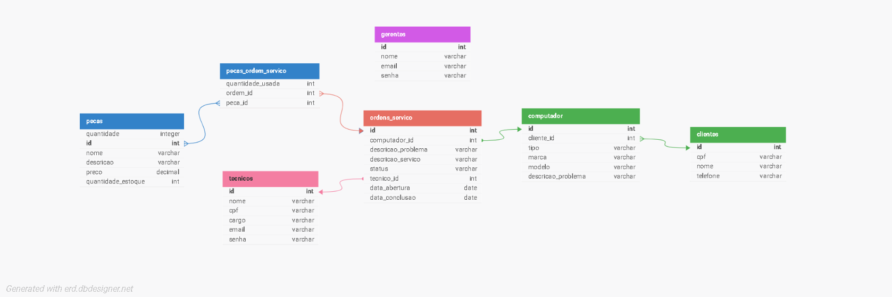

## 4. Projeto da solução

### 4.1. Modelo de dados

| Tabela de Relacionamento | Entidade 1              | Relacionamento       | Entidade 2              | Tipo de Relacionamento   |
|--------------------------|-------------------------|----------------------|-------------------------|--------------------------|
| Relacionamento 1         | Clientes                | (1) → (N)            | Computadores            | 1 para N                 |
| Relacionamento 2         | Computadores            | (1) → (N)            | Ordens de Serviço       | 1 para N                 |
| Relacionamento 3         | Ordens de Serviço       | (N) → (1)            | Técnicos                | N para 1                 |
| Relacionamento 4         | Ordens de Serviço       | (N) ↔ (N)            | Peças (via pecas_ordem_servico) | N para N (via tabela de junção) |

---

#### 4.2 Tecnologias e Implementação

O sistema será desenvolvido com tecnologias modernas, robustas e amplamente utilizadas no mercado, garantindo uma experiência de uso fluida, segura e escalável. Abaixo, detalhamos as tecnologias escolhidas, com justificativas para cada uma delas:

🔧 **Frontend (Interface do Usuário)**

- **React.js**: Uma biblioteca JavaScript para construção de interfaces de usuário interativas e responsivas.
- **JavaScript**: A linguagem base do React, essencial para criar funcionalidades dinâmicas e interativas no frontend.

**Por que usar React.js e JavaScript?**

- **React.js**:
  - Permite criar interfaces modernas e altamente responsivas, melhorando a experiência do usuário.
  - Facilita a reutilização de componentes, reduzindo o tempo de desenvolvimento e manutenção.
  - Possui uma grande comunidade de desenvolvedores e suporte, garantindo acesso a bibliotecas e ferramentas complementares.

- **JavaScript**:
  - É a base do desenvolvimento frontend e amplamente suportado por navegadores.
  - Oferece flexibilidade para implementar funcionalidades personalizadas e dinâmicas.

⚙️ **Backend (Lógica e Processamento)**

- **Java**: Uma linguagem de programação robusta, versátil e amplamente utilizada no desenvolvimento de sistemas corporativos.
- **Spring Boot**: Um framework para Java que simplifica a criação de APIs RESTful e sistemas backend escaláveis.

**Por que usar Java e Spring Boot?**

- **Java**:
  - Conhecido por sua estabilidade e desempenho, ideal para sistemas de missão crítica.
  - Possui forte suporte para integração com bancos de dados e outras tecnologias.
  - É multiplataforma, permitindo que o sistema seja executado em diferentes ambientes.

- **Spring Boot**:
  - Simplifica o desenvolvimento de aplicações Java, reduzindo a quantidade de configuração necessária.
  - Oferece suporte integrado para criação de APIs RESTful, autenticação e gerenciamento de dependências.
  - É altamente escalável, permitindo que o sistema cresça conforme a demanda.

💾 **Banco de Dados**

- **MySQL**: Um sistema de gerenciamento de banco de dados relacional (RDBMS).

**Por que usar MySQL?**

- É uma solução madura e confiável, amplamente utilizada em aplicações corporativas e web.
- Oferece excelente desempenho para consultas complexas e grandes volumes de dados.
- Possui suporte nativo para integração com Java e Spring Boot, facilitando o desenvolvimento.
- É uma solução econômica e fácil de escalar, ideal para sistemas que precisam crescer ao longo do tempo.

🔗 **Comunicação entre Frontend e Backend**

- **APIs RESTful**: Criadas com Spring Boot para comunicação entre o frontend (React.js) e o backend (Java).

**Por que usar APIs RESTful?**

- São amplamente utilizadas e padronizadas, garantindo compatibilidade com diferentes plataformas e dispositivos.
- Facilitam a separação entre frontend e backend, permitindo que ambas as partes sejam desenvolvidas e mantidas de forma independente.
- São leves e eficientes, ideais para sistemas que exigem alta performance.

🔒 **Segurança**

- **Spring Security**: Para autenticação e controle de acesso no backend.
- **JWT (JSON Web Tokens)**: Para autenticação baseada em tokens, garantindo segurança e escalabilidade.

**Por que usar essas tecnologias?**

- **Spring Security**:
  - Oferece uma solução completa para autenticação e autorização, protegendo as APIs contra acessos não autorizados.
  - Integra-se facilmente com Spring Boot, reduzindo a complexidade da implementação.
  
- **JWT**:
  - Permite autenticação sem a necessidade de armazenar sessões no servidor, tornando o sistema mais escalável.
  - É amplamente utilizado e compatível com diferentes plataformas, garantindo segurança no acesso ao sistema.

📊 **Relatórios e Análises**

- **Java com bibliotecas de geração de relatórios** (como JasperReports): Para criação de relatórios gerenciais detalhados.

**Por que usar essas tecnologias?**

- O Java, em conjunto com ferramentas como JasperReports, permite a geração de relatórios customizados e visualmente atraentes.
- Facilita a criação de dashboards gerenciais que auxiliam na tomada de decisões estratégicas.

**Benefícios da Escolha das Tecnologias**

- **Escalabilidade**: Todas as tecnologias escolhidas (React, Java, Spring Boot e MySQL) são conhecidas por sua capacidade de suportar sistemas em crescimento, tanto em número de usuários quanto em volume de dados.
- **Segurança**: O uso de Spring Security e JWT garante que o sistema esteja protegido contra acessos não autorizados e vulnerabilidades comuns.
- **Desempenho**: A combinação de React no frontend e Spring Boot no backend garante uma aplicação ágil e de alto desempenho.
- **Manutenção e Evolução**: Com tecnologias amplamente utilizadas no mercado, o sistema será fácil de manter e evoluir, com acesso a uma vasta comunidade de suporte e recursos.
- **Experiência do Usuário**: React.js, com sua abordagem baseada em componentes, permitirá criar interfaces intuitivas e responsivas, garantindo uma experiência de uso fluida para técnicos, gestores e clientes.

---

| **Dimensão**   | **Tecnologia**  |
| ---            | ---             |
| SGBD           | MySQL           |
| Front end      | React + JS      |
| Back end       | Java SpringBoot |
| Deploy         | Vercel          |

---

### Ferramentas, Frameworks, Bibliotecas, IDEs e Serviços Web

#### **🛠 Ferramentas e IDEs**
- **VS Code**: Ambiente de desenvolvimento para frontend com React e JavaScript, oferecendo suporte completo para desenvolvimento, depuração e controle de versões.
- **IntelliJ IDEA**: IDE para o desenvolvimento backend com Java e Spring Boot, oferecendo ferramentas avançadas de refatoração e depuração.
- **Postman**: Ferramenta essencial para testar APIs RESTful, permitindo a simulação de requisições e análise de respostas.

#### **⚙️ Frameworks e Bibliotecas**
- **React.js**: Biblioteca JavaScript para a criação da interface do usuário, altamente eficiente para construção de interfaces dinâmicas e responsivas.
- **Spring Boot**: Framework para o desenvolvimento de backend com Java, simplificando a criação de APIs RESTful e sistemas escaláveis.
- **Spring Security**: Framework para a implementação de segurança, oferecendo soluções robustas para autenticação e autorização no backend.
- **JasperReports**: Biblioteca para a criação de relatórios gerenciais personalizados, com suporte para exportação e personalização visual.

#### **🌐 Serviços Web**
- **Vercel**: Plataforma de deployment para o frontend (React.js), com integração contínua e escalabilidade automática, ideal para aplicações modernas.
- **GitHub**: Plataforma de controle de versão e integração contínua (CI/CD), proporcionando colaboração eficiente e automatização de processos de deploy.
